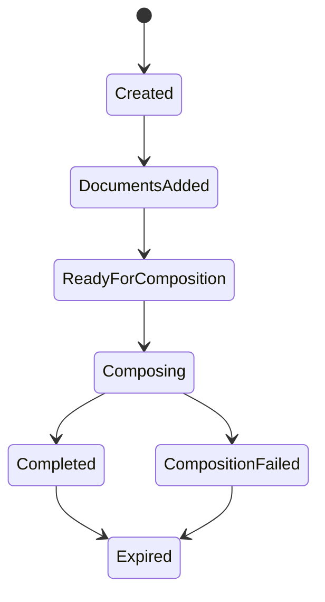

# Domain Model
The Document Composition domain captures the core business rules of the system: how Binders are created, how documents are added and ordered, when composition is allowed, and how the lifecycle progresses. This document describes the aggregates, value object, and domain events that define a Binder's behavior.

# Aggregates
Document Composition has two primary aggregates:
- Binder
- Document

The Binder aggregate is the root, the Documents belong to a Binder and cannot exist independently.

## Binder
### Responsibilities
- Maintain the ordered list of Documents
- Enforce page ordering invariants
- Track Binder lifecycle state
- Determine when composition is allowed
- Emit domain events for significant transitions

### Key Properties
| Name | Type |
|------|------|
| Id | `BinderId` |
| Status | `BinderStatus` |
| Documents | Collection of `Documents` |
| CreatedAt | `DateTime` |
| ExpiresAt | `DateTime` |
| OutputUri | `StorageUri` |

### Invariants
- Document order must be contiguous
- A Binder cannot be composed unless it has at least one page
- A Binder cannot be modified after composition begins
- A Binder cannot be modified after expiration
- A Binder cannot be composed twice

### Lifecycle
A Binder moves through several states:

- Created: The binder exists but no pages have been added
- DocumentsAdded: One or more Documents have been added to the Binder
- ReadyForComposition: The client has requested composition
- Composing: The worker is processing the Binder
- Completed: The worker has composed the Binder into a final PDF and uploaded it to storage
- CompositionFailed: The worker was unable to compose the Binder
- Expired: The cleanup policy has removed the data from this binder

## Document
A Document represents a single source document that will be normalized and composed.

### Responsibilities
- Represent a single document in the binder
- Maintain its order
- Store its storage URI
- Provide metadata needed for composition

### Key Properties
| Name | Type |
|------|------|
| Id | `PageId` |
| Order | `DocumentOrder` |
| SourceUri | `StorageUri` |
| MimeType | `ContentType` |
| UploadedAt | `DateTime` |

# Invariants
- Order must be greater than or equal to 1
- Order must be unique within the binder
- SourceUri must be absolute
- MimeType must be of an allowed type

# Value Objects
## BinderId
- Strongly typed identifier for Binders
- Based on Guidv7

## DocumentId
- Strongly typed identifier for Documents
- Based on Guidv7

## DocumentOrder
- A 1 based integer
- Ensures order is a positive integer

## StorageUri
- Encodes provider semantics
- Ensures URI is absolute (uses `file://`, `https://`)

# Domain Events
## BinderCreated
- Emitted when a new Binder is created

## DocumentAdded
- Emitted when a document is added to a binder

## CompositionRequested
- Emitted when the client requests composition
- Triggers the Application layer to enqueue a job

## CompositionCompleted
- Emitted when the API receives the worker callback

## BinderExpired
- Emitted when the expiration policy is applied

# Abstractions
## IBinderRepository
- Declares possible interactions with a collection of Binders
