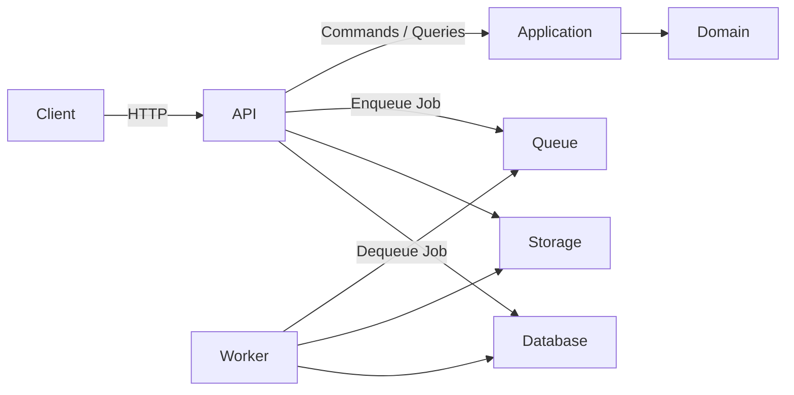
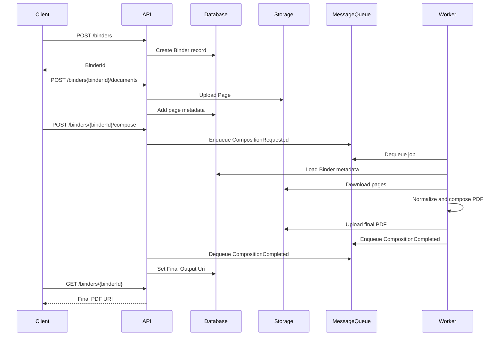

# System Overview
This document provides a high-level overview of the ThreeRing system: its components, responsibilities, and how data flows through the platform. ThreeRing is designed as a document composition engine that accepts flat, render-ready inputs (e.g. text files, images, PDFs) and produces a composed PDF output using a clean, layered architecture.

# Goals
ThreeRing is built to do the following:
- Accept flat, non-interactive documents like text files and images
- Normalize and compose them into a final PDF
- Support multiple storage providers (e.g. filesystem, blob, S3)
- Provide a clean, intention-revealing API
- Keep domain logic pur and infrastructure-agnostic
- Scale horizontally via a Worker that processes jobs asynchronously
- Maintain architectural clarity through explicit boundaries

# High-Level Architecture
ThreeRing consists of four major components:

- An API that serves as an HTTP interface and orchestration layer
- A Worker that performs PDF composition
- Storage providers that store source documents, working PDFs and output PDFs
- A database that persists Binder state and metadata
- A message queue that allows signalling and communication between the API, Worker and outside services

Here's the top level architecture:

# Component Responsibilities
## API
The API is the edge of the system. It is responsible for orchestration and delegation. It handles:
- Creating a Binder
- Uploading pages
- Reordering pages
- Requesting composition
- Returning Binder status
- Exposing the final PDF URI

## Worker
The Worker is intentionally simple and mechanical. It handles composition of the final PDF file. It:
- Listens for `CompositionRequested` messages on the message queue
- Downloads all source documents to local storage
- Normalizes source documents into PDF pages
- Composes the final PDF
- Uploads the output to storage
- Communicates completion with the API

## Domain
The Domain layer expresses the domain model in code in a way that is testable and free of infrastructure concerns. It defines:
- Aggregates like `Binder`
- Value objects like `BinderId`
- Invariants (e.g. A Document can not be added to a completed Binder)
- Policies like expiration dates
- Domain events like `CompositionRequested`

## Application
The application layer orchestrates use cases, coordinating domain logic:
- Commands like `CreateBinder` or `AddDocument`
- Queries like `GetBinder`
- Interfaces for persistence, storage and messaging

## Infrastructure
Infrastructure provides concrete implementations for the other layers:
- Database persistence
- Storage providers
- Messaging
- Logging, metrics and observability

# End-to-End Flow

# Storage Model
ThreeRing uses URI-based storage which allows for multiple providers:
- `file://` as a fallback when no other storage means are provided
- `https://` for cloud based blob storage
- `s3://` for S3-compatible providers

# Testing Strategy
ThreeRing uses a layered testing approach:
- Domain tests, for business logic while mocking any infrastructure needs
- Application tests, for command and query behavior
- API tests, HTTP surface testing
- Integration tests, for real database, storage and message queue integration